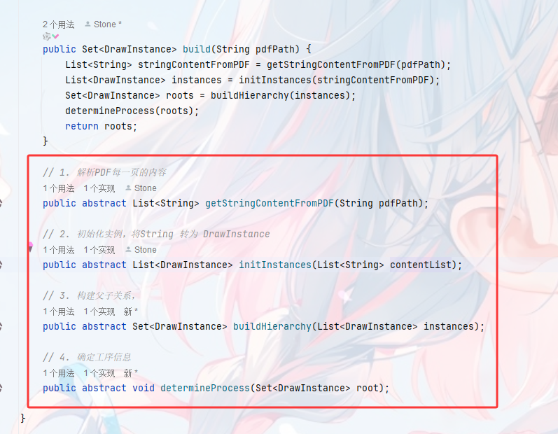

## 配套说明：

1. pdf 需要是合并的，里面要尽可能包含所有层级
2. 要能知道如何定位到 ***图号*** 字段（重要）
3. 要有 ***归属图号字段***
4. 钳工工序通过 pdf页 中包含 ***攻牙*** 确认
5. 折弯工序通过 pdf页 中同时包含 ***上/下*** 、***°*** 、***R*** 来确认
6. 焊接通过 pdf页 中包含 ***项目号 零件号 厚度 外形尺寸 数量 材料*** 来确认（即焊接表）
7. 焊接表中不存在的图号，默认视为管材类，有 ***切管-钳工-转焊接***  的工序
8. 下料工序通过是否有子工序来倒推，如果没有子工序，则视为需要添加 ***下料*** 工序

## 代码实现逻辑：

1. 获取pdf文字内容，并按照页面区分
2. 获取每个页面中图号、归属图号信息，创建实例
3. 根据页面中的字段，尽可能判断包含的工序（这里主要是钳工、折弯、焊接），然后放入实例成员变量中
4. 构建实例父子关系：根据归属图号信息和焊接表信息构建
5. 确认完整工序：将工序按照“下料、钳工、折弯、焊接”这四个优先级排序，没有子实例的添加“下料”工序（管材类除外），根据父实例第一道工序确定“转xx”，没有父实例则不存在“转工序”

